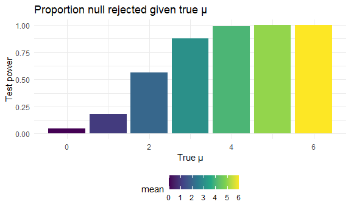
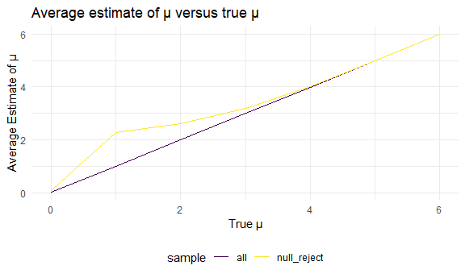

Homework 5
================
Shelley Shen
11/14/2020

### Problem 1

Read in the data.

``` r
homicide_df = 
  read_csv("homicide_data/homicide-data.csv") %>% 
  mutate(
    city_state = str_c(city, state, sep = "_"),
    resolved = case_when(
      disposition == "Closed without arrest" ~ "unsolved",
      disposition == "Open/No arrest"        ~ "unsolved",
      disposition == "Closed by arrest"      ~ "solved",
    )
  ) %>% 
  select(city_state, resolved) %>% 
  filter(city_state != "Tulsa_AL")
```

    ## Parsed with column specification:
    ## cols(
    ##   uid = col_character(),
    ##   reported_date = col_double(),
    ##   victim_last = col_character(),
    ##   victim_first = col_character(),
    ##   victim_race = col_character(),
    ##   victim_age = col_character(),
    ##   victim_sex = col_character(),
    ##   city = col_character(),
    ##   state = col_character(),
    ##   lat = col_double(),
    ##   lon = col_double(),
    ##   disposition = col_character()
    ## )

Create an aggregate DF

``` r
aggregate_df = 
  homicide_df %>% 
  group_by(city_state) %>% 
  summarize(
    hom_total = n(),
    hom_unsolved = sum(resolved == "unsolved")
  )
```

    ## `summarise()` ungrouping output (override with `.groups` argument)

Proportion test for a single city

``` r
prop.test(
  aggregate_df %>% filter(city_state == "Baltimore_MD") %>% pull(hom_unsolved), 
  aggregate_df %>% filter(city_state == "Baltimore_MD") %>% pull(hom_total)) %>% 
  broom::tidy()
```

    ## # A tibble: 1 x 8
    ##   estimate statistic  p.value parameter conf.low conf.high method    alternative
    ##      <dbl>     <dbl>    <dbl>     <int>    <dbl>     <dbl> <chr>     <chr>      
    ## 1    0.646      239. 6.46e-54         1    0.628     0.663 1-sample~ two.sided

Iterate for all cities

``` r
results_df = 
  aggregate_df %>% 
  mutate(
    prop_tests = map2(.x = hom_unsolved, .y = hom_total, ~prop.test(x = .x, n = .y)),
    tidy_tests = map(.x = prop_tests, ~broom::tidy(.x))
  ) %>% 
  select(-prop_tests) %>% 
  unnest(tidy_tests) %>% 
  select(city_state, estimate, conf.low, conf.high)
```

``` r
results_df %>% 
  mutate(city_state = fct_reorder(city_state, estimate)) %>% 
  ggplot(aes(x = city_state, y = estimate)) +
  geom_point() + 
  geom_errorbar(aes(ymin = conf.low, ymax = conf.high)) + 
  theme(axis.text.x = element_text(angle = 90, vjust = 0.5, hjust = 1))
```


### Problem 2

Read in data and create dataframe.

``` r
path_df = 
  tibble(
    path = list.files("lda_data")) %>% 
  mutate(
    path = str_c("lda_data/", path),
    data = map(.x = path, ~read_csv(.x))) %>% 
  unnest(data)
```

    ## Parsed with column specification:
    ## cols(
    ##   week_1 = col_double(),
    ##   week_2 = col_double(),
    ##   week_3 = col_double(),
    ##   week_4 = col_double(),
    ##   week_5 = col_double(),
    ##   week_6 = col_double(),
    ##   week_7 = col_double(),
    ##   week_8 = col_double()
    ## )
    ## Parsed with column specification:
    ## cols(
    ##   week_1 = col_double(),
    ##   week_2 = col_double(),
    ##   week_3 = col_double(),
    ##   week_4 = col_double(),
    ##   week_5 = col_double(),
    ##   week_6 = col_double(),
    ##   week_7 = col_double(),
    ##   week_8 = col_double()
    ## )
    ## Parsed with column specification:
    ## cols(
    ##   week_1 = col_double(),
    ##   week_2 = col_double(),
    ##   week_3 = col_double(),
    ##   week_4 = col_double(),
    ##   week_5 = col_double(),
    ##   week_6 = col_double(),
    ##   week_7 = col_double(),
    ##   week_8 = col_double()
    ## )
    ## Parsed with column specification:
    ## cols(
    ##   week_1 = col_double(),
    ##   week_2 = col_double(),
    ##   week_3 = col_double(),
    ##   week_4 = col_double(),
    ##   week_5 = col_double(),
    ##   week_6 = col_double(),
    ##   week_7 = col_double(),
    ##   week_8 = col_double()
    ## )
    ## Parsed with column specification:
    ## cols(
    ##   week_1 = col_double(),
    ##   week_2 = col_double(),
    ##   week_3 = col_double(),
    ##   week_4 = col_double(),
    ##   week_5 = col_double(),
    ##   week_6 = col_double(),
    ##   week_7 = col_double(),
    ##   week_8 = col_double()
    ## )
    ## Parsed with column specification:
    ## cols(
    ##   week_1 = col_double(),
    ##   week_2 = col_double(),
    ##   week_3 = col_double(),
    ##   week_4 = col_double(),
    ##   week_5 = col_double(),
    ##   week_6 = col_double(),
    ##   week_7 = col_double(),
    ##   week_8 = col_double()
    ## )
    ## Parsed with column specification:
    ## cols(
    ##   week_1 = col_double(),
    ##   week_2 = col_double(),
    ##   week_3 = col_double(),
    ##   week_4 = col_double(),
    ##   week_5 = col_double(),
    ##   week_6 = col_double(),
    ##   week_7 = col_double(),
    ##   week_8 = col_double()
    ## )
    ## Parsed with column specification:
    ## cols(
    ##   week_1 = col_double(),
    ##   week_2 = col_double(),
    ##   week_3 = col_double(),
    ##   week_4 = col_double(),
    ##   week_5 = col_double(),
    ##   week_6 = col_double(),
    ##   week_7 = col_double(),
    ##   week_8 = col_double()
    ## )
    ## Parsed with column specification:
    ## cols(
    ##   week_1 = col_double(),
    ##   week_2 = col_double(),
    ##   week_3 = col_double(),
    ##   week_4 = col_double(),
    ##   week_5 = col_double(),
    ##   week_6 = col_double(),
    ##   week_7 = col_double(),
    ##   week_8 = col_double()
    ## )
    ## Parsed with column specification:
    ## cols(
    ##   week_1 = col_double(),
    ##   week_2 = col_double(),
    ##   week_3 = col_double(),
    ##   week_4 = col_double(),
    ##   week_5 = col_double(),
    ##   week_6 = col_double(),
    ##   week_7 = col_double(),
    ##   week_8 = col_double()
    ## )
    ## Parsed with column specification:
    ## cols(
    ##   week_1 = col_double(),
    ##   week_2 = col_double(),
    ##   week_3 = col_double(),
    ##   week_4 = col_double(),
    ##   week_5 = col_double(),
    ##   week_6 = col_double(),
    ##   week_7 = col_double(),
    ##   week_8 = col_double()
    ## )
    ## Parsed with column specification:
    ## cols(
    ##   week_1 = col_double(),
    ##   week_2 = col_double(),
    ##   week_3 = col_double(),
    ##   week_4 = col_double(),
    ##   week_5 = col_double(),
    ##   week_6 = col_double(),
    ##   week_7 = col_double(),
    ##   week_8 = col_double()
    ## )
    ## Parsed with column specification:
    ## cols(
    ##   week_1 = col_double(),
    ##   week_2 = col_double(),
    ##   week_3 = col_double(),
    ##   week_4 = col_double(),
    ##   week_5 = col_double(),
    ##   week_6 = col_double(),
    ##   week_7 = col_double(),
    ##   week_8 = col_double()
    ## )
    ## Parsed with column specification:
    ## cols(
    ##   week_1 = col_double(),
    ##   week_2 = col_double(),
    ##   week_3 = col_double(),
    ##   week_4 = col_double(),
    ##   week_5 = col_double(),
    ##   week_6 = col_double(),
    ##   week_7 = col_double(),
    ##   week_8 = col_double()
    ## )
    ## Parsed with column specification:
    ## cols(
    ##   week_1 = col_double(),
    ##   week_2 = col_double(),
    ##   week_3 = col_double(),
    ##   week_4 = col_double(),
    ##   week_5 = col_double(),
    ##   week_6 = col_double(),
    ##   week_7 = col_double(),
    ##   week_8 = col_double()
    ## )
    ## Parsed with column specification:
    ## cols(
    ##   week_1 = col_double(),
    ##   week_2 = col_double(),
    ##   week_3 = col_double(),
    ##   week_4 = col_double(),
    ##   week_5 = col_double(),
    ##   week_6 = col_double(),
    ##   week_7 = col_double(),
    ##   week_8 = col_double()
    ## )
    ## Parsed with column specification:
    ## cols(
    ##   week_1 = col_double(),
    ##   week_2 = col_double(),
    ##   week_3 = col_double(),
    ##   week_4 = col_double(),
    ##   week_5 = col_double(),
    ##   week_6 = col_double(),
    ##   week_7 = col_double(),
    ##   week_8 = col_double()
    ## )
    ## Parsed with column specification:
    ## cols(
    ##   week_1 = col_double(),
    ##   week_2 = col_double(),
    ##   week_3 = col_double(),
    ##   week_4 = col_double(),
    ##   week_5 = col_double(),
    ##   week_6 = col_double(),
    ##   week_7 = col_double(),
    ##   week_8 = col_double()
    ## )
    ## Parsed with column specification:
    ## cols(
    ##   week_1 = col_double(),
    ##   week_2 = col_double(),
    ##   week_3 = col_double(),
    ##   week_4 = col_double(),
    ##   week_5 = col_double(),
    ##   week_6 = col_double(),
    ##   week_7 = col_double(),
    ##   week_8 = col_double()
    ## )
    ## Parsed with column specification:
    ## cols(
    ##   week_1 = col_double(),
    ##   week_2 = col_double(),
    ##   week_3 = col_double(),
    ##   week_4 = col_double(),
    ##   week_5 = col_double(),
    ##   week_6 = col_double(),
    ##   week_7 = col_double(),
    ##   week_8 = col_double()
    ## )

Tidy the data.

``` r
path_tidy =
  path_df %>% 
  separate(path, into = c("folder", "arm"), sep = 9) %>% 
  separate(arm, into = c("arm", "id"), sep = "_") %>% 
  separate(id, into = c("id", "file"), sep = 2) %>% 
  select(-folder, -file) %>% 
  mutate(
    id = str_remove(id, "0"),
    arm = str_replace_all(arm, c("con" = "control", "exp" = "experimental"))
    ) %>% 
  pivot_longer(
    week_1:week_8,
    names_to = "week",
    values_to = "value",
    names_prefix = "week_")
```

Create a spaghetti plot showing observations on each subject over time.

``` r
lda_plot = 
  path_tidy %>% 
  group_by(arm, id) %>% 
  ggplot(
    aes(x = week, y = value, group = id, color = id)) +
  geom_point() +
  geom_line() +
  geom_point(alpha = 0.5) +
  facet_grid(arm ~.) +
  labs(
    title = "Observations for control vs. experimental arms over time",
    x = "Week of Observation",
    y = "Values"
  )
```

From the spaghetti plot, we see that generally, the experimental group
had higher observation values than the control group. While the
experimental group observations increased over time, the control group
remained consistent without any significant changes overall. The
consistency of the control arm is reasonable as it did not receive any
treatment, and any change within the control is likely due to a placebo
effect.

### Question 3

Creating the t-test function.

``` r
t_test = function(sample_size = 30, mu, sigma = 5) {
  simulation = 
    tibble(x = rnorm(n = sample_size, mean = mu, sd = sigma))
  simulation %>% 
  t.test() %>% 
  broom::tidy()
}
```

Set µ = 0

``` r
sim_results = 
  rerun(5000, t_test(mu = 0)) %>% 
  bind_rows()
sim_results %>% 
  select(estimate, p.value)
```

    ## # A tibble: 5,000 x 2
    ##    estimate p.value
    ##       <dbl>   <dbl>
    ##  1  -0.0918  0.913 
    ##  2   1.39    0.0682
    ##  3   0.936   0.377 
    ##  4   1.52    0.127 
    ##  5  -0.174   0.808 
    ##  6   1.33    0.207 
    ##  7  -0.804   0.493 
    ##  8  -1.23    0.204 
    ##  9  -0.835   0.373 
    ## 10   2.04    0.0178
    ## # ... with 4,990 more rows

Repeat for means 1 to 6.

``` r
rep_sim_results = 
  tibble(mean = c(0, 1, 2, 3, 4, 5, 6)) %>% 
  mutate(
    output_lists = map(.x = mean, ~rerun(5000, t_test(mu = .x))),
    estimate_dfs = map(output_lists, bind_rows)) %>% 
  select(-output_lists) %>% 
  unnest(estimate_dfs)
rep_sim_results %>% 
  select(mean, estimate, p.value)
```

    ## # A tibble: 35,000 x 3
    ##     mean estimate p.value
    ##    <dbl>    <dbl>   <dbl>
    ##  1     0  -0.661   0.445 
    ##  2     0  -0.234   0.792 
    ##  3     0   0.381   0.654 
    ##  4     0  -0.356   0.735 
    ##  5     0  -0.732   0.455 
    ##  6     0  -2.45    0.0363
    ##  7     0  -0.0463  0.954 
    ##  8     0   0.0832  0.923 
    ##  9     0  -0.150   0.848 
    ## 10     0  -1.25    0.220 
    ## # ... with 34,990 more rows

Create plot showing proportion of times the null was rejected vs true
value of µ

``` r
rep_sim_results %>% 
  select(mean, estimate, p.value) %>% 
  group_by(mean) %>% 
  summarize(prop_reject = sum(p.value <= 0.05) / n()) %>% 
  ggplot(aes(x = mean, y = prop_reject, fill = mean)) +
  geom_bar(stat = 'identity') +
  labs(
    title = "Proportion null rejected given true µ",
    x = "True µ",
    y = "Test power"
  )
```

    ## `summarise()` ungrouping output (override with `.groups` argument)



The plot shows that as the true mean increases, the effect size
increases and also causes an increase of power for the study.

## Create plot showing average estimate of true and estimated μ

``` r
all_samp = 
  rep_sim_results %>% 
    select(mean, estimate, p.value) %>% 
    group_by(mean) %>% 
    summarize(all = mean(estimate))
```

    ## `summarise()` ungrouping output (override with `.groups` argument)

``` r
rejected_samp = 
  rep_sim_results %>% 
    select(mean, estimate, p.value) %>% 
    filter(p.value <= 0.05) %>% 
    group_by(mean) %>% 
    summarize(null_reject = mean(estimate))
```

    ## `summarise()` ungrouping output (override with `.groups` argument)

``` r
left_join(all_samp, rejected_samp, by = "mean") %>% 
  pivot_longer(
    all:null_reject,
    names_to = "sample",
    values_to = "average_estimate"
  ) %>% 
  ggplot(aes(x = mean, y = average_estimate, color = sample)) +
  geom_line() +
  labs(
    title = "Average estimate of µ versus true µ",
    x = "True µ",
    y = "Average Estimate of µ"
  )
```



The plot shows that the average estimate of µ is not the same as that of
all the samples. The average estimate of µ does get closer though as the
true µ increases and gets further away from 0.
